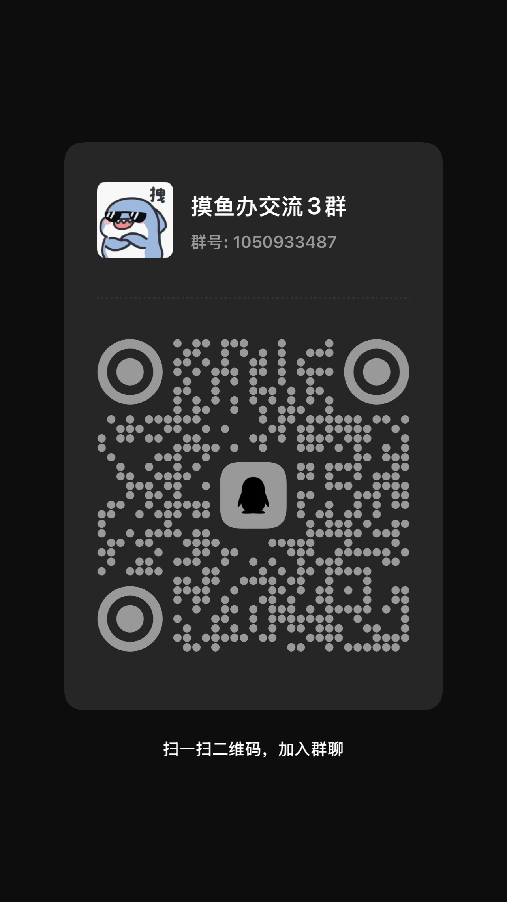

# ➤ X-Cursor Help（无限续杯Free用户，一直白嫖一直爽）

  

  

获取最新版本请加入QQ群：1050933487

<h4>支持最新版本</h4>

本工具仅供体验交流目的使用，当前仓库不违反任何法律。如果可以请支持原始项目。

## ✨ 功能特点

* 支持Windows、macOS系统

* 重置X-Cursor的配置

## 💻 系统支持

| 操作系统 | 架构 | 支持 |
|------------------|-------------------|----------|
| Windows | x64, x86 | ✅ |
| macOS | Intel, Apple Silicon | ✅ |
| Linux | x64, x86, ARM64 | ❌ |

## 👀 如何使用

加入qq群获取下载链接，然后自行查看文档即可

## 📩 免责声明

本工具仅供学习和研究使用，使用本工具所产生的任何后果由使用者自行承担。

## 💰 请我喝杯咖啡

  <table>
    <tr>
      <td>
         
      </td>
      <td>
         
      </td>
      <td>
         
      </td>
    </tr>
  </table>

